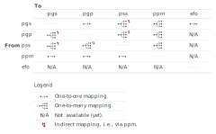

```{r, include = FALSE}
knitr::opts_chunk$set(
  collapse = TRUE,
  comment = "#>"
)
```

## Introduction

The data provided by quincunx includes various identifiers. This document serves as a quick reference list for the identifiers you might find in objects returned by quincunx functions.

Some of these identifiers are externally defined while others are created by quincunx to aid linking rows among tables. The external identifiers have global scope, i.e., their meaning is valid regardless of context, e.g., a PGS identifier is unique and always identifies the same polygenic score. Identifiers whose scope is local are surrogate IDs that help relating data observations across tables, and do not have any other special meaning outside the tables they appear (`sample_id`, `effect_size_id`, `classification_metrics_id` and `other_metrics_id`.)

| Variable                    | Name                            | Acronym | Scope  | Database source                                              |
| --------------------------- | ------------------------------- | ------- | ------ | ------------------------------------------------------------ |
| `pgs_id`, `child_pgs_id`    | Polygenic Score ID              | PGS     | global | [PGS Catalog](https://www.pgscatalog.org/)                   |
| `pgp_id`                    | Polygenic Publication ID        | PGP     | global | [PGS Catalog](https://www.pgscatalog.org/)                   |
| `pss_id`                    | PGS Catalog Sample Set ID       | PSS     | global | [PGS Catalog](https://www.pgscatalog.org/)                   |
| `ppm_id`                    | PGS Performance Metric ID       | PPM     | global | [PGS Catalog](https://www.pgscatalog.org/)                   |
| `efo_id`, `parent_efo_id`   | Experimental Factor Ontology ID | EFO     | global | [Experimental Factor Ontology](https://www.ebi.ac.uk/efo/)   |
| `pubmed_id`                 | PubMed ID                       | PMID    | global | [PubMed.gov](https://pubmed.ncbi.nlm.nih.gov/)               |
| `study_id`                  | GWAS Catalog Study ID           | GCST    | global | [GWAS Catalog](https://www.ebi.ac.uk/gwas/)                  |
| `rsID`                      | Reference SNP Cluster ID        | rsID    | global | [dbSNP](https://www.ncbi.nlm.nih.gov/snp/docs/RefSNP_about/) |
| `sample_id`                 | Sample ID                       |         | local  | Generated by quincunx.                                       |
| `effect_size_id`            | Effect Size ID                  |         | local  | Generated by quincunx.                                       |
| `classification_metrics_id` | Classification Metrics ID       |         | local  | Generated by quincunx.                                       |
| `other_metrics_id`          | Other Metrics ID                |         | local  | Generated by quincunx.                                       |

## Mapping between identifiers

In the table below you can see the type of mappings---one-to-one or one-to-many---possible between the main PGS Catalog entity identifiers. Those mappings indicated as N/A are not implemented yet. These mappings are provided by a set of functions of the form `<from_id>_to_<to_id>()`, e.g., the function `pgs_to_pgp()` provides the mapping of PGS identifiers (`pgs_id`) to PGP identifiers (`pgp_id`). You can find all available id-mapping functions under [Accession identifier mapping](https://maialab.org/quincunx/reference/index.html#accession-identifier-mapping).

```{r  out.width = "90%", echo=FALSE}
 
```

As a technical side note, those mappings marked with ↯ are achieved by successive requests to different endpoints, e.g., for the function `pss_to_pgs()` to find the associated `pgs_id` with one or more `pss_id`, it needs first to map `pss_id` to `ppm_id`, and only then from those obtained `ppm_id` to `pgs_id`.
