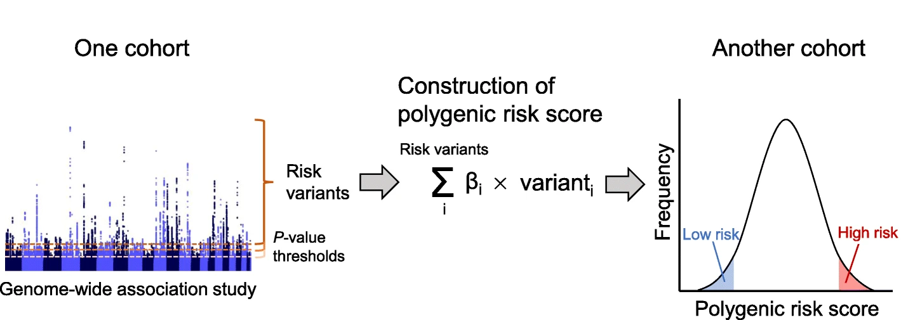
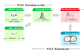

```{r, include = FALSE}
knitr::opts_chunk$set(
  collapse = TRUE,
  comment = "#>"
)
library(quincunx)
```

## Overview of polygenic risk score construction

PGS is calculated as a weighted sum of several risk variants from a genome-wide
association study in one or more samples with multiple p-value thresholds. The
effect sizes are typically estimated as β (beta coefficients) or as odds ratios.
After the PGS is calculated in one sample, the distribution of individual PGS is
assessed in another in an independent sample set.

```{r  out.width = "90%", echo=FALSE, fig.cap='Adapted from [Konuma & Okada (2021)](https://doi.org/10.1186/s41232-021-00172-9), [CC BY 4.0](https://creativecommons.org/licenses/by/4.0/).'}
 
```

## PGS development and evaluation stages

```{r  out.width = "80%", echo=FALSE}
 
```

In the PGS Catalog, cohorts and samples are annotated according to their
utilisation context, i.e. stage, in the PGS construction process. In quincunx,
the stage is indicated by the `stage` variable that can have one of these
values:

- `gwas`: to annotate samples used to derive variant associations (GWAS)
- `dev`: to annotate samples used in the development or training of PGSs
- `gwas/dev`: as a catch-all term to annotate samples used either in `gwas` or `dev` stages
- `eval`: to annotate samples used in the PGS evaluation stage

You will encounter the stage annotation in tables of objects returned by
quincunx's retrieval functions. Here are a few examples:

### In a `scores` object

```{r}
get_scores('PGS000327')@samples
```

### In a `sample_sets` object

```{r}
get_sample_sets(pgs_id = 'PGS000327')@samples
```

### In a `performance_metrics` object

```{r}
get_performance_metrics(pgs_id = 'PGS000327')@samples
```

### In the `stages_tally` table:

```{r}
get_scores('PGS000327')@stages_tally
```

### In the `ancestry_frequencies` table:

```{r}
get_scores('PGS000012')@ancestry_frequencies
```

### And in `multi_ancestry_composition` table:

```{r}
get_scores('PGS000012')@multi_ancestry_composition
```

### In a `cohorts` object:

```{r}
get_cohorts('23andMe')@pgs_ids
```
